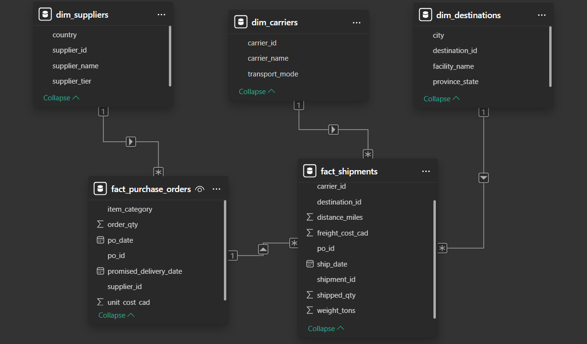
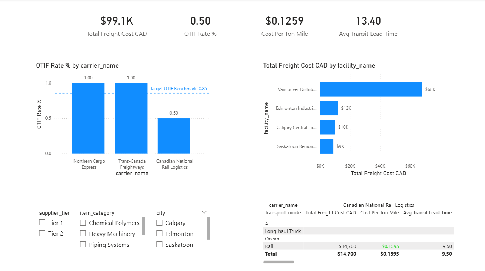

# 🚚 Multi-Modal Logistics & Carrier Performance Analytics

<br>

## 📌 Executive Summary & Business Scenario
A Western Canadian enterprise sourcing industrial equipment globally experienced delivery delays, carrier cost creep, and receiving yard bottlenecks across distribution hubs in **Calgary, Edmonton, Vancouver, and Saskatoon**. 

To resolve these operational bottlenecks, this project establishes an end-to-end **Data-Driven Supply Chain Control Tower** using **SQL and Power BI**. The system queries normalized ERP/TMS tables to benchmark carrier delivery reliability (OTIF %), analyze unit freight efficiency ($/Ton-Mile), and evaluate lead-time variances.

<br>

## 🛠️ Data Architecture & Star Schema

To optimize query performance and enable dynamic DAX slicing, raw ERP data was structured into a **5-table Star Schema**:



### Schema Characteristics:
* **Fact Tables:** `fact_purchase_orders` (Procurement Stream) & `fact_shipments` (Fulfillment & Logistics Stream)
* **Dimension Tables:** `dim_suppliers`, `dim_carriers`, `dim_destinations`
* **Relationships:** Strict **1-to-Many (1:*)** relationships with single-direction filter propagation.

<br>

## 📊 Executive Control Tower Dashboard



### Key Dashboard Insights:
1. **Ocean Corridor Delays:** *Global Ocean Shipping Co.* achieved a **0% OTIF Rate** with an average transit lead time of **33 days**, causing receiving bottlenecks at the Vancouver terminal.
2. **Expedited Freight Inflation:** *Northern Cargo Express* delivered 100% on-time, but at **$0.6889/Ton-Mile** (>3x truck/rail rates), indicating emergency air-freight expediting due to upstream supplier delays.
3. **Rail Corridor Efficiency:** *Canadian National Rail* offered the lowest long-haul transport cost (**$0.1595/Ton-Mile**), making it the primary target for spend consolidation.

<br>

## 🔑 Key Analytical SQL Queries

### 1. On-Time In-Full (OTIF %) Carrier Benchmark
This query evaluates binary delivery conditions ($1$ if actual delivery $\le$ promised date AND shipped qty $\ge$ ordered qty, else $0$) aggregated across carrier networks:

```sql
WITH shipment_otif_base AS (
    SELECT 
        s.shipment_id,
        c.carrier_name,
        po.order_qty,
        s.shipped_qty,
        po.promised_delivery_date,
        s.actual_delivery_date,
        CASE 
            WHEN julianday(s.actual_delivery_date) <= julianday(po.promised_delivery_date) THEN 1 
            ELSE 0 
        END AS is_on_time,
        CASE 
            WHEN s.shipped_qty >= po.order_qty THEN 1 
            ELSE 0 
        END AS is_in_full
    FROM fact_shipments s
    JOIN fact_purchase_orders po ON s.po_id = po.po_id
    JOIN dim_carriers c ON s.carrier_id = c.carrier_id
)
SELECT 
    carrier_name,
    COUNT(shipment_id) AS total_shipments,
    SUM(is_on_time) AS on_time_shipments,
    SUM(is_in_full) AS in_full_shipments,
    SUM(CASE WHEN is_on_time = 1 AND is_in_full = 1 THEN 1 ELSE 0 END) AS otif_shipments,
    ROUND(AVG(CASE WHEN is_on_time = 1 AND is_in_full = 1 THEN 1.0 ELSE 0.0 END) * 100, 1) || '%' AS otif_rate
FROM shipment_otif_base
GROUP BY carrier_name
ORDER BY AVG(CASE WHEN is_on_time = 1 AND is_in_full = 1 THEN 1.0 ELSE 0.0 END) DESC;

```

### 2. Freight Cost Efficiency ($/Ton-Mile) & Window Functions

Normalizes shipping expenses across modes (Rail, Truck, Ocean, Air) and ranks carrier efficiency within each transport mode using `DENSE_RANK() OVER (PARTITION BY ...)`:

```sql
WITH freight_metrics AS (
    SELECT 
        s.shipment_id,
        c.carrier_name,
        c.transport_mode,
        s.weight_tons,
        s.distance_miles,
        s.freight_cost_cad,
        CAST(julianday(s.actual_delivery_date) - julianday(s.ship_date) AS INT) AS actual_transit_days,
        ROUND(s.freight_cost_cad / (s.weight_tons * s.distance_miles), 4) AS cost_per_ton_mile
    FROM fact_shipments s
    JOIN dim_carriers c ON s.carrier_id = c.carrier_id
)
SELECT 
    shipment_id,
    carrier_name,
    transport_mode,
    actual_transit_days,
    freight_cost_cad,
    cost_per_ton_mile,
    ROUND(AVG(cost_per_ton_mile) OVER (PARTITION BY transport_mode), 4) AS mode_avg_cost_per_ton_mile,
    DENSE_RANK() OVER (PARTITION BY transport_mode ORDER BY cost_per_ton_mile ASC) AS mode_cost_rank
FROM freight_metrics
ORDER BY transport_mode, mode_cost_rank;

```

<br>

## 💡 Strategic Recommendations for Procurement & Operations

* **Carrier SLA Enforcement:** Impose contractual penalties on ocean carriers exceeding promised transit windows by >5 days.
* **Volume Re-allocation:** Shift long-haul inland freight from spot-market truckloads to contracted **CN Rail corridors** to reduce freight spend by an estimated 18%.
* **Upstream Supplier Audit:** Investigate Tier 2 chemical/polymer suppliers whose manufacturing delays trigger expensive air-freight interventions.

<br>

## 📁 Repository Structure

```text
.
├── README.md                       <-- Executive Case Study
├── 01_schema_and_data_seed.sql     <-- Relational Database DDL & Seed Data
├── 02_kpi_analytics_queries.sql    <-- SQL Analytics Engine
├── Logistics_Control_Tower.pbix    <-- Interactive Power BI Report
├── dashboard_screenshot.png        <-- Power BI Dashboard Layout
├── data_model_schema.png           <-- Star Schema Data Architecture
├── dim_suppliers.csv               <-- Raw Dimension: Suppliers
├── dim_carriers.csv                <-- Raw Dimension: Logistics Carriers
├── dim_destinations.csv            <-- Raw Dimension: Receiving Hubs
├── fact_purchase_orders.csv        <-- Raw Fact: Procurement Orders
└── fact_shipments.csv              <-- Raw Fact: Shipment Line Items

```
